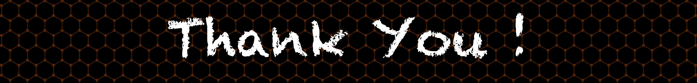

<!-- Theme: https://github.com/anuraghazra/github-readme-stats --> 

## :bar_chart: GitHub Stats

 
## :link: Pinned Repos 

## 🔧 Technologies & Tools

&nbsp;
&nbsp;

## :file_folder: Resume 
+ [MasrulResume](./MasrulHuda-CV.pdf)

<!-- https://github.com/jayehernandez/jayehernandez/blob/main/README.md -->

  

    
    
    
  

